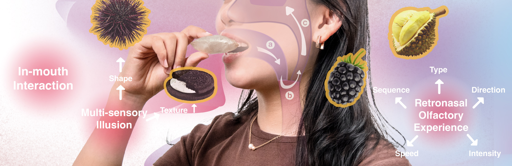

# Welcome to **AromaBite**

**AromaBite** is an innovative toolkit designed to enhance flavor experiences through retronasal scent release. Unlike traditional olfactory displays, AromaBite integrates natural eating behaviors with non-electrical, edible materials to offer a multisensory experience. Using dynamic, inflatable chambers filled with scented air, it releases aroma through natural interactions like chewing and swallowing.

## Key Features:
- **Non-Electrical Design**: Fully edible and requires no electronics for scent release.
- **Sustainable Materials**: Created from rice paper and other biodegradable materials.
- **Dynamic Scent Release**: Provides multi-dimensional olfactory experiences.
- **Multi-sensory Integration**: Incorporates texture, scent, and tactile interaction for an immersive flavor experience.